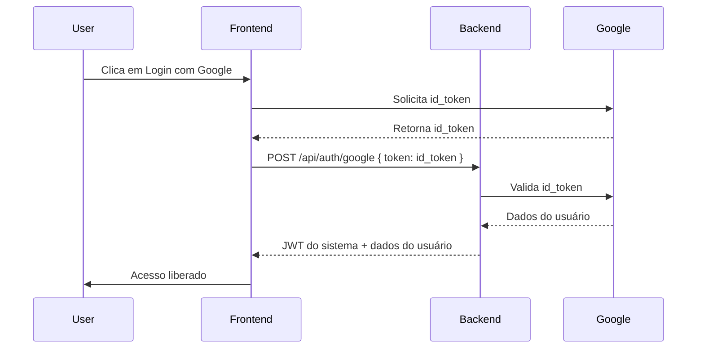

# Documentação Técnica

Este diretório é destinado a documentação complementar do Sistema Lancei Essa.

## Exemplo: Fluxo de Autenticação Google



### Exemplo de payload enviado para o backend
```json
{
  "token": "ID_TOKEN_DO_GOOGLE"
}
```

### Exemplo de resposta do backend
```json
{
  "user": {
    "id": "...",
    "email": "...",
    "name": "...",
    "googleId": "...",
    "createdAt": "..."
  },
  "token": "JWT_DO_SISTEMA"
}
```

---

Sugestões de tópicos para detalhar aqui:
- Fluxos de autenticação (diagramas, exemplos de payload)
- Estrutura de banco de dados (ERD, migrations)
- Exemplos de endpoints e respostas
- Integração com APIs externas (YouTube, Google)
- Padrões de código e arquitetura
- Dicas de troubleshooting

Contribua adicionando arquivos e tópicos relevantes! 