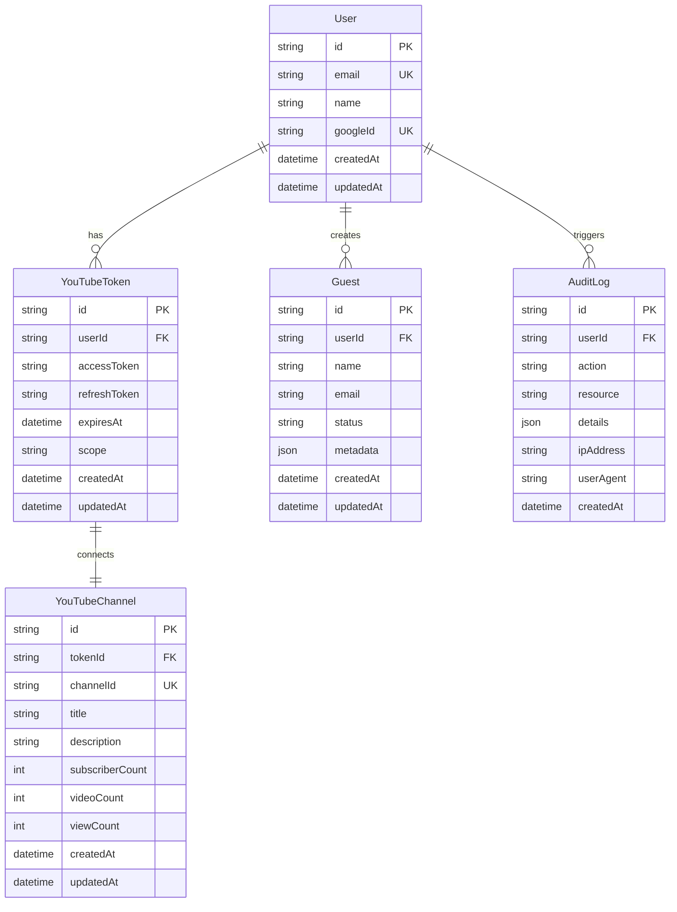

# 🗄️ **SCHEMA DO BANCO DE DADOS - SISTEMA LANCEI ESSA**

**Data de Criação:** 29/01/2025  
**Última Atualização:** 29/01/2025  
**Versão:** 1.0  
**Responsável:** AI Assistant  
**Status:** ✅ Ativo

---

## 🎯 **OBJETIVO**

Este documento detalha o schema do banco de dados do Sistema Lancei Essa, incluindo tabelas, relacionamentos, índices e estratégias de migração.

---

## 📊 **DIAGRAMA ENTIDADE-RELACIONAMENTO**



---

## 📋 **TABELAS DETALHADAS**

### 👤 **Users**
Armazena informações dos usuários autenticados via Google.

```sql
CREATE TABLE users (
    id VARCHAR(36) PRIMARY KEY DEFAULT (uuid()),
    email VARCHAR(255) NOT NULL UNIQUE,
    name VARCHAR(255) NOT NULL,
    google_id VARCHAR(255) NOT NULL UNIQUE,
    created_at TIMESTAMP DEFAULT CURRENT_TIMESTAMP,
    updated_at TIMESTAMP DEFAULT CURRENT_TIMESTAMP ON UPDATE CURRENT_TIMESTAMP,
    
    INDEX idx_users_email (email),
    INDEX idx_users_google_id (google_id),
    INDEX idx_users_created_at (created_at)
);
```

#### **Campos:**
| Campo | Tipo | Nulo | Descrição |
|-------|------|------|-----------|
| `id` | VARCHAR(36) | ❌ | UUID único do usuário |
| `email` | VARCHAR(255) | ❌ | Email do Google (único) |
| `name` | VARCHAR(255) | ❌ | Nome completo do usuário |
| `google_id` | VARCHAR(255) | ❌ | ID único do Google (único) |
| `created_at` | TIMESTAMP | ❌ | Data de criação |
| `updated_at` | TIMESTAMP | ❌ | Última atualização |

#### **Regras de Negócio:**
- Email deve ser válido e único
- Google ID deve ser único
- Nome é obrigatório
- Soft delete não implementado (hard delete)

### 🔑 **YouTube Tokens**
Armazena tokens OAuth2 para acesso ao YouTube Analytics.

```sql
CREATE TABLE youtube_tokens (
    id VARCHAR(36) PRIMARY KEY DEFAULT (uuid()),
    user_id VARCHAR(36) NOT NULL,
    access_token TEXT NOT NULL,
    refresh_token TEXT NOT NULL,
    expires_at TIMESTAMP NOT NULL,
    scope VARCHAR(500) DEFAULT 'https://www.googleapis.com/auth/youtube.readonly',
    created_at TIMESTAMP DEFAULT CURRENT_TIMESTAMP,
    updated_at TIMESTAMP DEFAULT CURRENT_TIMESTAMP ON UPDATE CURRENT_TIMESTAMP,
    
    FOREIGN KEY (user_id) REFERENCES users(id) ON DELETE CASCADE,
    INDEX idx_youtube_tokens_user_id (user_id),
    INDEX idx_youtube_tokens_expires_at (expires_at)
);
```

#### **Campos:**
| Campo | Tipo | Nulo | Descrição |
|-------|------|------|-----------|
| `id` | VARCHAR(36) | ❌ | UUID único do token |
| `user_id` | VARCHAR(36) | ❌ | FK para users.id |
| `access_token` | TEXT | ❌ | Token de acesso (criptografado) |
| `refresh_token` | TEXT | ❌ | Token de refresh (criptografado) |
| `expires_at` | TIMESTAMP | ❌ | Expiração do access_token |
| `scope` | VARCHAR(500) | ✅ | Escopo das permissões |
| `created_at` | TIMESTAMP | ❌ | Data de criação |
| `updated_at` | TIMESTAMP | ❌ | Última atualização |

#### **Segurança:**
- Tokens são criptografados antes do storage
- Refresh automático via cronjob
- Expiração monitorada

### 📺 **YouTube Channels**
Cache dos dados do canal do YouTube.

```sql
CREATE TABLE youtube_channels (
    id VARCHAR(36) PRIMARY KEY DEFAULT (uuid()),
    token_id VARCHAR(36) NOT NULL,
    channel_id VARCHAR(255) NOT NULL UNIQUE,
    title VARCHAR(255) NOT NULL,
    description TEXT,
    subscriber_count INT DEFAULT 0,
    video_count INT DEFAULT 0,
    view_count BIGINT DEFAULT 0,
    created_at TIMESTAMP DEFAULT CURRENT_TIMESTAMP,
    updated_at TIMESTAMP DEFAULT CURRENT_TIMESTAMP ON UPDATE CURRENT_TIMESTAMP,
    
    FOREIGN KEY (token_id) REFERENCES youtube_tokens(id) ON DELETE CASCADE,
    INDEX idx_youtube_channels_token_id (token_id),
    INDEX idx_youtube_channels_channel_id (channel_id),
    INDEX idx_youtube_channels_updated_at (updated_at)
);
```

#### **Campos:**
| Campo | Tipo | Nulo | Descrição |
|-------|------|------|-----------|
| `id` | VARCHAR(36) | ❌ | UUID único do registro |
| `token_id` | VARCHAR(36) | ❌ | FK para youtube_tokens.id |
| `channel_id` | VARCHAR(255) | ❌ | ID único do canal no YouTube |
| `title` | VARCHAR(255) | ❌ | Nome do canal |
| `description` | TEXT | ✅ | Descrição do canal |
| `subscriber_count` | INT | ✅ | Número de inscritos |
| `video_count` | INT | ✅ | Número de vídeos |
| `view_count` | BIGINT | ✅ | Total de visualizações |
| `created_at` | TIMESTAMP | ❌ | Data de criação |
| `updated_at` | TIMESTAMP | ❌ | Última sincronização |

#### **Cache Strategy:**
- Atualização a cada 1 hora
- Invalidação manual via endpoint
- TTL baseado em `updated_at`

### 👥 **Guests**
Sistema de gerenciamento de convidados.

```sql
CREATE TABLE guests (
    id VARCHAR(36) PRIMARY KEY DEFAULT (uuid()),
    user_id VARCHAR(36) NOT NULL,
    name VARCHAR(255) NOT NULL,
    email VARCHAR(255),
    status ENUM('pending', 'confirmed', 'cancelled') DEFAULT 'pending',
    metadata JSON,
    created_at TIMESTAMP DEFAULT CURRENT_TIMESTAMP,
    updated_at TIMESTAMP DEFAULT CURRENT_TIMESTAMP ON UPDATE CURRENT_TIMESTAMP,
    
    FOREIGN KEY (user_id) REFERENCES users(id) ON DELETE CASCADE,
    INDEX idx_guests_user_id (user_id),
    INDEX idx_guests_status (status),
    INDEX idx_guests_email (email),
    INDEX idx_guests_created_at (created_at)
);
```

#### **Campos:**
| Campo | Tipo | Nulo | Descrição |
|-------|------|------|-----------|
| `id` | VARCHAR(36) | ❌ | UUID único do convidado |
| `user_id` | VARCHAR(36) | ❌ | FK para users.id |
| `name` | VARCHAR(255) | ❌ | Nome do convidado |
| `email` | VARCHAR(255) | ✅ | Email do convidado |
| `status` | ENUM | ❌ | Status do convite |
| `metadata` | JSON | ✅ | Dados adicionais flexíveis |
| `created_at` | TIMESTAMP | ❌ | Data de criação |
| `updated_at` | TIMESTAMP | ❌ | Última atualização |

#### **Status Flow:**
```
pending → confirmed
pending → cancelled
confirmed → cancelled (opcional)
```

### 📋 **Audit Logs**
Log de auditoria para rastreamento de ações.

```sql
CREATE TABLE audit_logs (
    id VARCHAR(36) PRIMARY KEY DEFAULT (uuid()),
    user_id VARCHAR(36),
    action VARCHAR(255) NOT NULL,
    resource VARCHAR(255) NOT NULL,
    details JSON,
    ip_address VARCHAR(45),
    user_agent TEXT,
    created_at TIMESTAMP DEFAULT CURRENT_TIMESTAMP,
    
    FOREIGN KEY (user_id) REFERENCES users(id) ON DELETE SET NULL,
    INDEX idx_audit_logs_user_id (user_id),
    INDEX idx_audit_logs_action (action),
    INDEX idx_audit_logs_resource (resource),
    INDEX idx_audit_logs_created_at (created_at)
);
```

#### **Campos:**
| Campo | Tipo | Nulo | Descrição |
|-------|------|------|-----------|
| `id` | VARCHAR(36) | ❌ | UUID único do log |
| `user_id` | VARCHAR(36) | ✅ | FK para users.id (pode ser null) |
| `action` | VARCHAR(255) | ❌ | Ação realizada |
| `resource` | VARCHAR(255) | ❌ | Recurso afetado |
| `details` | JSON | ✅ | Detalhes adicionais |
| `ip_address` | VARCHAR(45) | ✅ | IP do usuário |
| `user_agent` | TEXT | ✅ | User agent do browser |
| `created_at` | TIMESTAMP | ❌ | Timestamp da ação |

#### **Ações Típicas:**
- `user.login`, `user.logout`
- `youtube.connect`, `youtube.disconnect`
- `guest.create`, `guest.update`, `guest.delete`
- `token.refresh`, `token.expire`

---

## 🔧 **PRISMA SCHEMA**

### 📄 **schema.prisma**
```prisma
generator client {
  provider = "prisma-client-js"
}

datasource db {
  provider = "postgresql" // ou "sqlite" para dev
  url      = env("DATABASE_URL")
}

model User {
  id        String   @id @default(uuid())
  email     String   @unique
  name      String
  googleId  String   @unique @map("google_id")
  createdAt DateTime @default(now()) @map("created_at")
  updatedAt DateTime @updatedAt @map("updated_at")

  // Relacionamentos
  youtubeTokens YouTubeToken[]
  guests        Guest[]
  auditLogs     AuditLog[]

  @@map("users")
  @@index([email])
  @@index([googleId])
}

model YouTubeToken {
  id           String   @id @default(uuid())
  userId       String   @map("user_id")
  accessToken  String   @map("access_token") @db.Text
  refreshToken String   @map("refresh_token") @db.Text
  expiresAt    DateTime @map("expires_at")
  scope        String   @default("https://www.googleapis.com/auth/youtube.readonly")
  createdAt    DateTime @default(now()) @map("created_at")
  updatedAt    DateTime @updatedAt @map("updated_at")

  // Relacionamentos
  user    User             @relation(fields: [userId], references: [id], onDelete: Cascade)
  channel YouTubeChannel?

  @@map("youtube_tokens")
  @@index([userId])
  @@index([expiresAt])
}

model YouTubeChannel {
  id              String   @id @default(uuid())
  tokenId         String   @unique @map("token_id")
  channelId       String   @unique @map("channel_id")
  title           String
  description     String?  @db.Text
  subscriberCount Int      @default(0) @map("subscriber_count")
  videoCount      Int      @default(0) @map("video_count")
  viewCount       BigInt   @default(0) @map("view_count")
  createdAt       DateTime @default(now()) @map("created_at")
  updatedAt       DateTime @updatedAt @map("updated_at")

  // Relacionamentos
  token YouTubeToken @relation(fields: [tokenId], references: [id], onDelete: Cascade)

  @@map("youtube_channels")
  @@index([channelId])
  @@index([updatedAt])
}

model Guest {
  id        String      @id @default(uuid())
  userId    String      @map("user_id")
  name      String
  email     String?
  status    GuestStatus @default(PENDING)
  metadata  Json?
  createdAt DateTime    @default(now()) @map("created_at")
  updatedAt DateTime    @updatedAt @map("updated_at")

  // Relacionamentos
  user User @relation(fields: [userId], references: [id], onDelete: Cascade)

  @@map("guests")
  @@index([userId])
  @@index([status])
  @@index([email])
}

model AuditLog {
  id        String   @id @default(uuid())
  userId    String?  @map("user_id")
  action    String
  resource  String
  details   Json?
  ipAddress String?  @map("ip_address")
  userAgent String?  @map("user_agent") @db.Text
  createdAt DateTime @default(now()) @map("created_at")

  // Relacionamentos
  user User? @relation(fields: [userId], references: [id], onDelete: SetNull)

  @@map("audit_logs")
  @@index([userId])
  @@index([action])
  @@index([resource])
  @@index([createdAt])
}

enum GuestStatus {
  PENDING
  CONFIRMED
  CANCELLED
}
```

---

## 📈 **OTIMIZAÇÕES E ÍNDICES**

### 🚀 **Estratégia de Indexação**
```sql
-- Índices principais (já na definição das tabelas)
-- Índices compostos para queries comuns
CREATE INDEX idx_guests_user_status ON guests(user_id, status);
CREATE INDEX idx_audit_logs_user_action ON audit_logs(user_id, action);
CREATE INDEX idx_youtube_tokens_user_expires ON youtube_tokens(user_id, expires_at);

-- Índices de texto para busca (se necessário)
CREATE INDEX idx_guests_name_text ON guests USING gin(to_tsvector('portuguese', name));
```

### 📊 **Query Patterns**
```sql
-- Query mais comum: buscar tokens não expirados
SELECT * FROM youtube_tokens 
WHERE user_id = ? AND expires_at > NOW();

-- Query frequente: convidados por status
SELECT * FROM guests 
WHERE user_id = ? AND status = 'pending' 
ORDER BY created_at DESC;

-- Query de auditoria
SELECT * FROM audit_logs 
WHERE user_id = ? AND action LIKE 'youtube.%' 
ORDER BY created_at DESC LIMIT 50;
```

---

## 🔄 **MIGRAÇÕES**

### 📋 **Estratégia de Migração**
```bash
# Desenvolvimento
npx prisma migrate dev --name init

# Produção
npx prisma migrate deploy

# Reset (apenas dev)
npx prisma migrate reset
```

### 🗃️ **Backup Strategy**
```bash
# Backup completo
pg_dump sistema_lancei_essa > backup_$(date +%Y%m%d).sql

# Backup apenas schema
pg_dump --schema-only sistema_lancei_essa > schema_backup.sql

# Restore
psql sistema_lancei_essa < backup_20250129.sql
```

---

## 🔐 **SEGURANÇA DO BANCO**

### 🛡️ **Práticas Implementadas**
- **Encryption at Rest:** Tokens sensíveis criptografados
- **Connection Pooling:** Limite de conexões configurado
- **Query Validation:** Prisma previne SQL injection
- **Access Control:** Usuário específico com permissões limitadas

### 🔒 **Dados Sensíveis**
```javascript
// ✅ BOM - Criptografar antes de salvar
const encryptedToken = encrypt(accessToken, process.env.ENCRYPTION_KEY);
await prisma.youTubeToken.create({
  data: { accessToken: encryptedToken, ... }
});

// ❌ RUIM - Nunca salvar em texto plano
await prisma.youTubeToken.create({
  data: { accessToken: plainTextToken, ... }
});
```

---

## 📊 **MONITORAMENTO**

### 📈 **Métricas Importantes**
- **Connection Pool:** Utilização e timeouts
- **Query Performance:** Tempo médio por query
- **Storage:** Crescimento de dados
- **Backup Status:** Sucesso/falha de backups

### 🔍 **Queries de Monitoramento**
```sql
-- Tamanho das tabelas
SELECT 
  schemaname,
  tablename,
  pg_size_pretty(pg_total_relation_size(schemaname||'.'||tablename)) as size
FROM pg_tables 
WHERE schemaname = 'public'
ORDER BY pg_total_relation_size(schemaname||'.'||tablename) DESC;

-- Queries mais lentas
SELECT query, mean_time, calls 
FROM pg_stat_statements 
ORDER BY mean_time DESC LIMIT 10;

-- Índices não utilizados
SELECT schemaname, tablename, indexname, idx_tup_read, idx_tup_fetch
FROM pg_stat_user_indexes 
WHERE idx_tup_read = 0;
```

---

## 🔗 **LINKS RELACIONADOS**

### 📚 **Documentação**
- [Prisma Documentation](https://www.prisma.io/docs)
- [PostgreSQL Documentation](https://www.postgresql.org/docs/)
- [API Design](api-design.md)

### 🛠️ **Ferramentas**
- [Prisma Studio](http://localhost:5555)
- [Database Migrations](../../scripts/migrations/)
- [Backup Scripts](../../scripts/backup/)

---

**💡 Um schema bem documentado é a base de um sistema confiável e escalável!**
