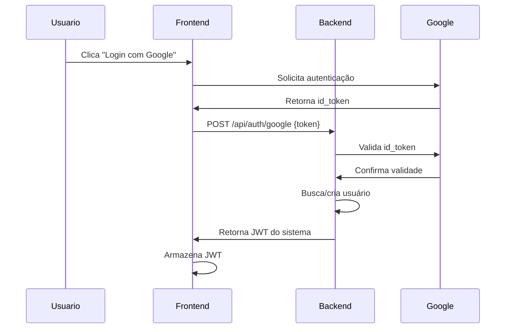
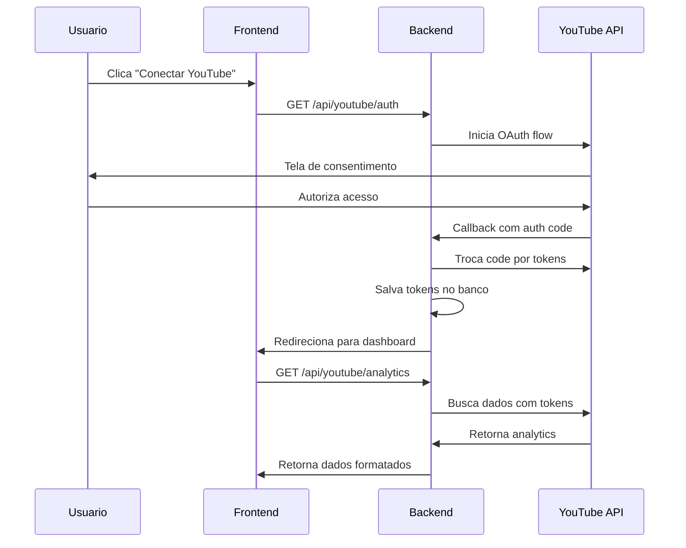
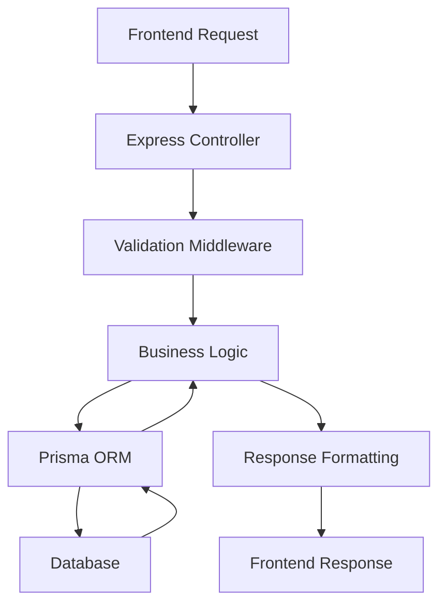

# 🏗️ **VISÃO GERAL DA ARQUITETURA - SISTEMA LANCEI ESSA**

**Data de Criação:** 29/01/2025  
**Última Atualização:** 29/01/2025  
**Versão:** 1.0  
**Responsável:** AI Assistant  
**Status:** ✅ Ativo

---

## 🎯 **OBJETIVO**

Este documento apresenta uma visão geral da arquitetura do Sistema Lancei Essa, fornecendo aos desenvolvedores o entendimento necessário para contribuir efetivamente com o projeto.

---

## 🏛️ **ARQUITETURA GERAL**

### 📊 **Diagrama de Alto Nível**
```
┌─────────────────┐    ┌─────────────────┐    ┌─────────────────┐
│   FRONTEND      │    │    BACKEND      │    │   INTEGRAÇÕES   │
│   React + Vite  │◄──►│  Node.js/Express│◄──►│     Google      │
│   TypeScript    │    │    + Prisma     │    │   YouTube API   │
│   Port: 5173    │    │   Port: 4000    │    │   OAuth 2.0     │
└─────────────────┘    └─────────────────┘    └─────────────────┘
          │                       │                       │
          │              ┌─────────────────┐             │
          └──────────────►│   DATABASE      │◄────────────┘
                          │   PostgreSQL    │
                          │   SQLite (dev)  │
                          └─────────────────┘
```

### 🧩 **Componentes Principais**

#### 🎨 **Frontend (React + TypeScript)**
- **Framework:** React 18 com TypeScript
- **Build Tool:** Vite para desenvolvimento rápido
- **Styling:** CSS moderno com componentes reutilizáveis
- **Estado:** Context API para gerenciamento global
- **Autenticação:** Google One Tap + JWT

#### ⚙️ **Backend (Node.js + Express)**
- **Runtime:** Node.js 18+
- **Framework:** Express.js para APIs RESTful
- **ORM:** Prisma para gerenciamento de banco
- **Autenticação:** JWT + Google OAuth validation
- **Integrações:** YouTube Analytics API

#### 🗄️ **Banco de Dados**
- **Desenvolvimento:** SQLite (arquivo local)
- **Produção:** PostgreSQL (recomendado)
- **Migrações:** Prisma Migrate
- **Schema:** Versionado e tipado

#### 🔌 **Integrações Externas**
- **Google Identity:** Autenticação de usuários
- **YouTube Analytics API:** Dados de canais e métricas
- **OAuth 2.0:** Fluxo seguro de autorização

---

## 📁 **ESTRUTURA DO PROJETO**

### 🗂️ **Organização de Diretórios**
```
Sistema Lancei Essa/
├── apps/
│   ├── frontend/                 # React + TypeScript
│   │   ├── src/
│   │   │   ├── components/       # Componentes reutilizáveis
│   │   │   ├── pages/           # Páginas principais
│   │   │   ├── services/        # Calls para API
│   │   │   ├── utils/           # Utilitários
│   │   │   └── types/           # Definições TypeScript
│   │   ├── public/              # Assets estáticos
│   │   └── vite.config.ts       # Configuração do Vite
│   └── backend/                 # Node.js + Express
├── backend/                     # API Principal
│   ├── src/
│   │   ├── controllers/         # Lógica de negócio
│   │   ├── models/              # Modelos de dados
│   │   ├── routes/              # Definição de rotas
│   │   ├── services/            # Serviços externos
│   │   ├── middlewares/         # Middlewares customizados
│   │   └── config/              # Configurações
│   ├── prisma/                  # Schema e migrações
│   └── logs/                    # Logs da aplicação
├── docs/                        # Documentação completa
├── scripts/                     # Scripts de automação
└── packages/                    # Pacotes compartilhados
```

### 🎯 **Convenções de Nomenclatura**
- **Arquivos:** kebab-case (`user-controller.js`)
- **Componentes:** PascalCase (`UserProfile.tsx`)
- **Variáveis:** camelCase (`userName`)
- **Constantes:** UPPER_SNAKE_CASE (`JWT_SECRET`)
- **Rotas:** kebab-case (`/api/user-profile`)

---

## 🔄 **FLUXO DE DADOS**

### 🔐 **Autenticação**


### 📊 **Integração YouTube**


### 🗄️ **Persistência de Dados**


---

## 🔧 **TECNOLOGIAS E DEPENDÊNCIAS**

### 📦 **Frontend Dependencies**
```json
{
  "react": "^18.2.0",
  "typescript": "^5.2.2",
  "vite": "^5.0.0",
  "@types/react": "^18.2.43",
  "react-router-dom": "^6.x",
  "axios": "^1.x"
}
```

### 📦 **Backend Dependencies**
```json
{
  "express": "^4.18.2",
  "prisma": "^5.x",
  "@prisma/client": "^5.x",
  "jsonwebtoken": "^9.x",
  "google-auth-library": "^9.x",
  "googleapis": "^129.x",
  "winston": "^3.x"
}
```

### 🛠️ **Ferramentas de Desenvolvimento**
- **Linting:** ESLint + Prettier
- **Testing:** Jest + Testing Library
- **Bundling:** Vite (frontend) + Node.js (backend)
- **Database:** Prisma Studio para visualização
- **Logs:** Winston para logging estruturado

---

## 🔐 **SEGURANÇA**

### 🛡️ **Práticas Implementadas**
- **JWT Tokens:** Autenticação stateless segura
- **OAuth 2.0:** Fluxo padrão da indústria
- **Secrets Management:** Variáveis de ambiente
- **CORS:** Configuração adequada para dev/prod
- **Rate Limiting:** Proteção contra abuse
- **Input Validation:** Sanitização de dados

### 🔒 **Dados Sensíveis**
```javascript
// ✅ BOM - Nunca expor
process.env.JWT_SECRET
process.env.YOUTUBE_CLIENT_SECRET
userTokens.access_token

// ❌ RUIM - Nunca fazer
res.json({ secret: process.env.JWT_SECRET })
console.log('Token:', accessToken)
```

---

## 📊 **PERFORMANCE**

### ⚡ **Otimizações Frontend**
- **Code Splitting:** Lazy loading de componentes
- **Bundle Optimization:** Tree shaking automático
- **Asset Optimization:** Compressão de imagens
- **Caching:** Service Worker para assets

### 🚀 **Otimizações Backend**
- **Connection Pooling:** Prisma connection pool
- **Response Caching:** Redis para dados frequentes
- **Query Optimization:** Índices de banco otimizados
- **Compression:** gzip para responses

### 📈 **Métricas**
- **Frontend:** <100ms first paint, <1MB bundle
- **Backend:** <200ms response time, <1% error rate
- **Database:** <50ms query time médio

---

## 🧪 **ESTRATÉGIA DE TESTES**

### 🔬 **Pirâmide de Testes**
```
        /\
       /  \    E2E Tests (Cypress)
      /____\   Integration Tests (Supertest)
     /      \  Unit Tests (Jest)
    /________\ 
```

### ✅ **Cobertura de Testes**
- **Unit Tests:** 80%+ cobertura de funções críticas
- **Integration Tests:** Fluxos principais de API
- **E2E Tests:** Jornadas completas do usuário

---

## 🚀 **DEPLOYMENT**

### 🏗️ **Estratégia de Deploy**
- **Development:** Local com SQLite
- **Staging:** Docker containers + PostgreSQL
- **Production:** Cloud deployment (AWS/Vercel)

### 🔄 **CI/CD Pipeline**
```yaml
stages:
  - lint          # ESLint + Prettier
  - test          # Jest + Cypress
  - build         # Vite build + Docker
  - deploy        # Deploy automático
```

---

## 🔗 **LINKS RELACIONADOS**

### 📚 **Documentação Técnica**
- [Database Schema](database-schema.md)
- [API Design](api-design.md)
- [Quick Start](../quick-start.md)

### 🛠️ **Ferramentas**
- [Prisma Studio](http://localhost:5555)
- [API Documentation](../../api/)
- [Component Library](../../ui-components/)

---

## 🤝 **CONTRIBUINDO**

### 📋 **Antes de Contribuir**
1. Leia este documento completamente
2. Configure o ambiente local
3. Execute todos os testes
4. Siga os padrões de código

### 🔄 **Processo de Development**
1. Fork do repositório
2. Feature branch (`feature/nova-funcionalidade`)
3. Desenvolvimento com testes
4. Pull request com descrição detalhada

---

**💡 Uma arquitetura bem documentada acelera o desenvolvimento e reduz bugs!**
