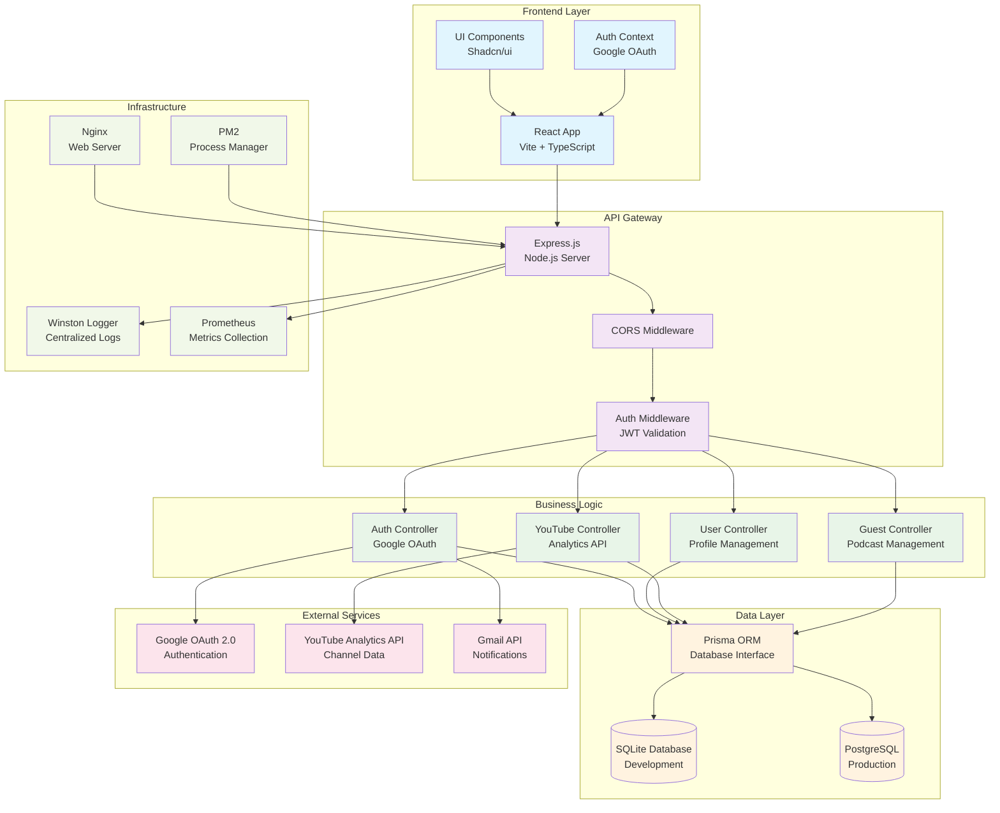
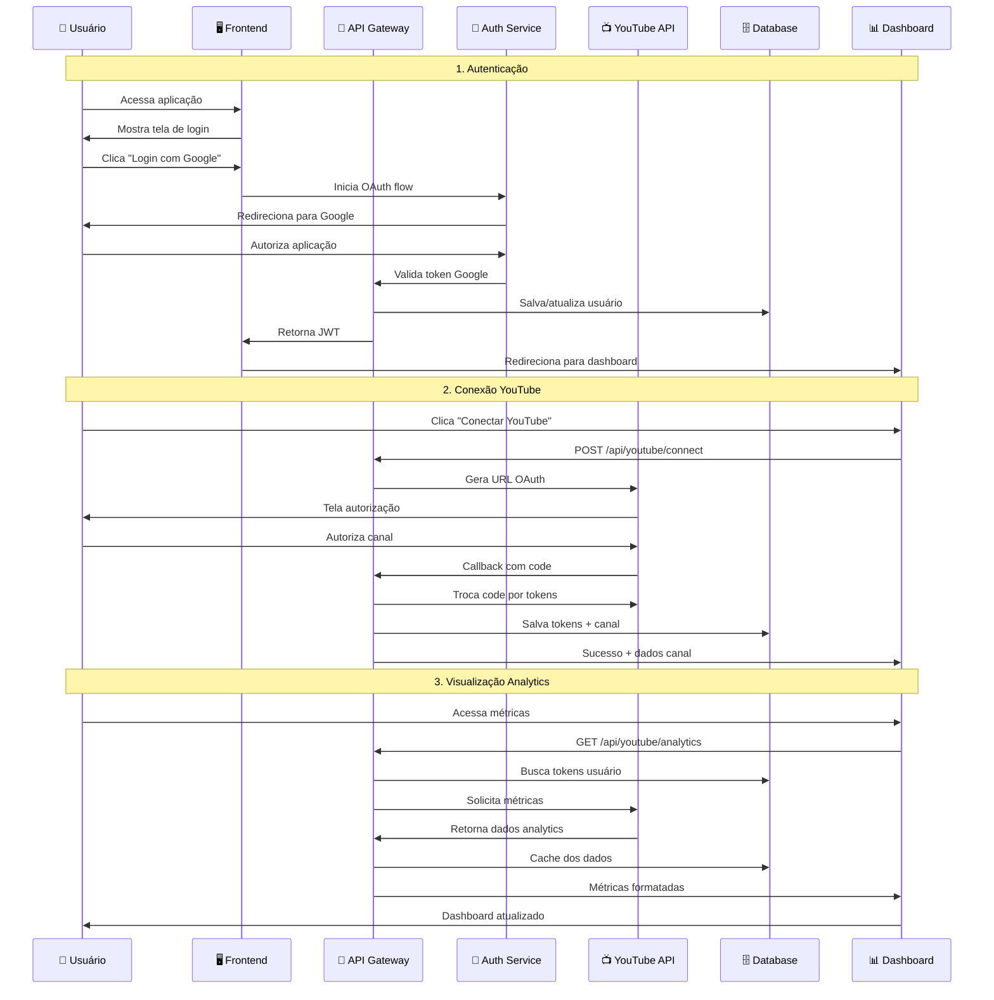
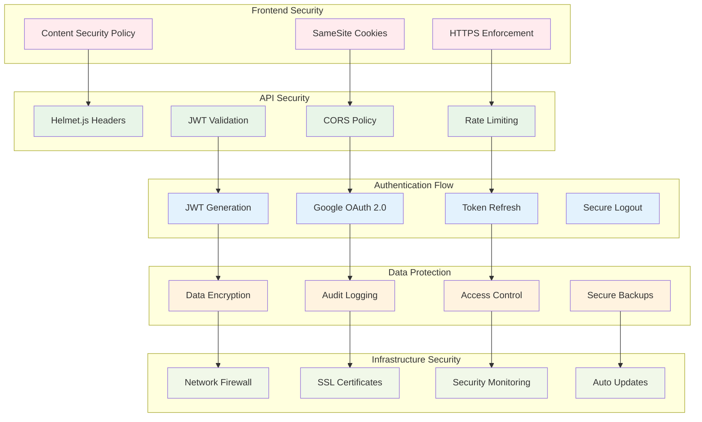
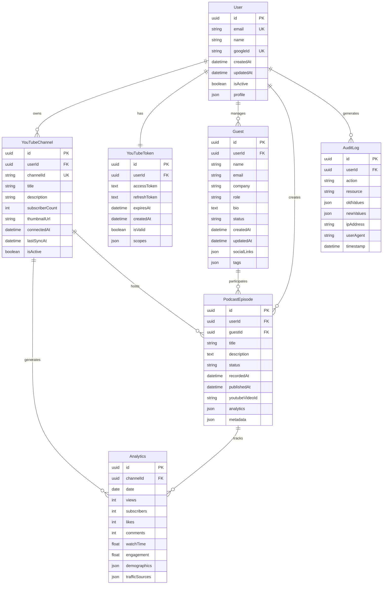
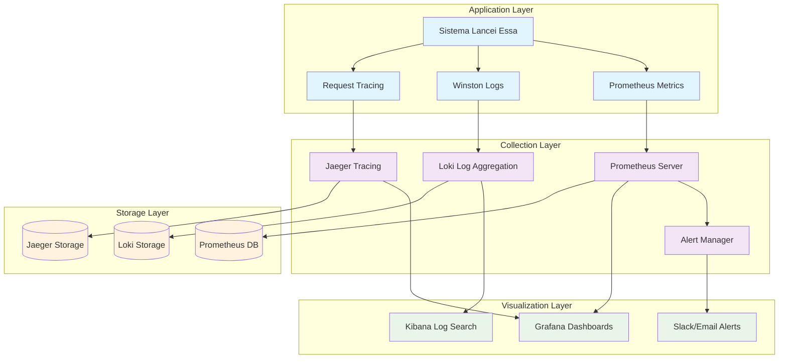
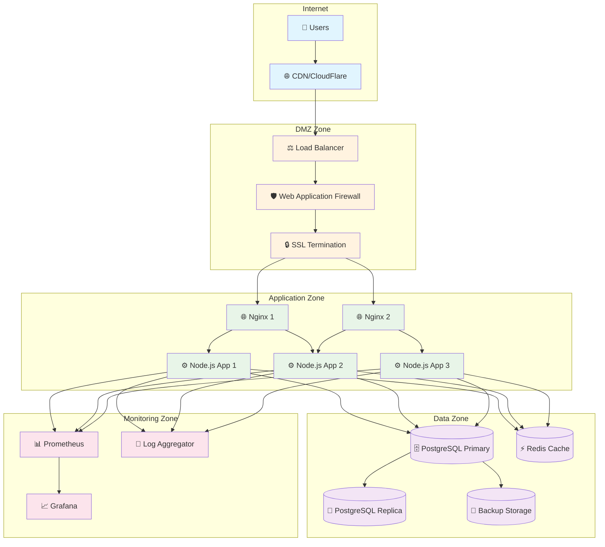

# 🏗️ **VISÃO GERAL DO SISTEMA - ARQUITETURA COMPLETA**

**Data de Criação:** 29/01/2025  
**Última Atualização:** 29/01/2025  
**Versão:** 1.0  
**Responsável:** AI Assistant  
**Status:** ✅ Ativo

---

## 🎯 **OBJETIVO**

Este documento apresenta uma visão abrangente da arquitetura do Sistema Lancei Essa através de diagramas visuais avançados, facilitando a compreensão da estrutura e fluxos do sistema.

---

## 🏗️ **ARQUITETURA GERAL DO SISTEMA**

### 🔧 **Diagrama de Alto Nível**

---

## 🔄 **FLUXO DE DADOS PRINCIPAL**

### 📊 **Jornada Completa do Usuário**

---

## 🔐 **ARQUITETURA DE SEGURANÇA**

### 🛡️ **Camadas de Proteção**

---

## 🗄️ **MODELO DE DADOS DETALHADO**

### 📊 **Relacionamentos entre Entidades**

---

## 🚀 **FLUXO DE DEPLOYMENT**

### 📦 **Pipeline CI/CD**

```mermaid
graph LR
    subgraph "Development"
        Dev[👨‍💻 Developer]
        Git[📝 Git Commit]
        PR[🔄 Pull Request]
    end
    
    subgraph "CI Pipeline"
        GHA[⚙️ GitHub Actions]
        Test[🧪 Run Tests]
        Build[🏗️ Build App]
        Lint[✅ Code Quality]
    end
    
    subgraph "Staging"
        Deploy_STG[🚀 Deploy Staging]
        Test_STG[🔍 E2E Tests]
        Review[👁️ Manual Review]
    end
    
    subgraph "Production"
        Deploy_PROD[🌐 Deploy Production]
        Health[🏥 Health Checks]
        Monitor[📊 Monitoring]
        Rollback[⏪ Rollback Plan]
    end
    
    subgraph "Infrastructure"
        Docker[🐳 Docker Containers]
        Nginx[🌐 Nginx Proxy]
        DB[🗄️ Database]
        Logs[📝 Centralized Logs]
    end
    
    %% Flow
    Dev --> Git
    Git --> PR
    PR --> GHA
    
    GHA --> Test
    Test --> Build
    Build --> Lint
    Lint --> Deploy_STG
    
    Deploy_STG --> Test_STG
    Test_STG --> Review
    Review --> Deploy_PROD
    
    Deploy_PROD --> Health
    Health --> Monitor
    Monitor --> Rollback
    
    Deploy_PROD --> Docker
    Docker --> Nginx
    Nginx --> DB
    DB --> Logs
    
    %% Styling
    classDef dev fill:#e1f5fe
    classDef ci fill:#f3e5f5
    classDef staging fill:#e8f5e8
    classDef prod fill:#fff3e0
    classDef infra fill:#fce4ec
    
    class Dev,Git,PR dev
    class GHA,Test,Build,Lint ci
    class Deploy_STG,Test_STG,Review staging
    class Deploy_PROD,Health,Monitor,Rollback prod
    class Docker,Nginx,DB,Logs infra
```

---

## 📊 **MONITORAMENTO E OBSERVABILIDADE**

### 🔍 **Stack de Observabilidade**

---

## 🌐 **ARQUITETURA DE REDE**

### 🔧 **Infraestrutura de Produção**

---

## 🔗 **LINKS RELACIONADOS**

### 📚 **Documentação Técnica**
- [Database Schema](database-schema.md)
- [API Authentication](../api/authentication.md)
- [YouTube Integration](../api/youtube-integration.md)

### 🛠️ **Código Fonte**
- [Backend Architecture](../../../backend/src/)
- [Frontend Components](../../../apps/frontend/src/)
- [Infrastructure Config](../../../config/)

### 📊 **Operações**
- [Deployment Guide](../../operations/deployment.md)
- [Monitoring Setup](../../operations/monitoring.md)

---

**🏗️ Uma arquitetura bem documentada é a base para um sistema escalável e mantível!** 