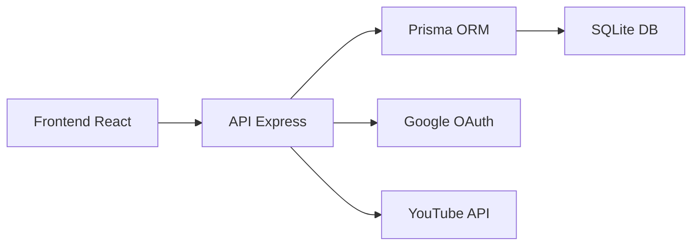

# ⚡ Quick Start - Desenvolvimento

**Data:** 29/01/2025  
**Responsável:** AI Assistant  
**Versão:** 1.0  
**Status:** ✅ Ativo  

---

## 🎯 **Objetivo**

Configurar o ambiente de desenvolvimento do Sistema Lancei Essa em **menos de 10 minutos**.

### 🏆 **O que você vai conseguir:**
- ✅ **Ambiente completo** rodando localmente
- 🔧 **Hot reload** no frontend e backend
- 🗄️ **Banco de dados** configurado
- 🔑 **OAuth Google** funcionando
- 📊 **YouTube API** integrada

---

## 📋 **Pré-requisitos**

### **💻 Software Necessário**
- [ ] **Node.js** >= 18.0.0 ([nodejs.org](https://nodejs.org/))
- [ ] **npm** >= 8.0.0 (vem com Node.js)
- [ ] **Git** ([git-scm.com](https://git-scm.com/))
- [ ] **Editor de código** (VS Code recomendado)

### **🔑 Credenciais Necessárias**
- [ ] **Google Cloud Project** com YouTube API habilitada
- [ ] **OAuth2 Client ID** e Secret
- [ ] **Redirect URI** configurada

> **💡 Dica:** Se não tem as credenciais, veja o [Guia de Configuração do Google OAuth](../setup/CONFIGURAR_GOOGLE_OAUTH.md)

---

## ⚡ **Setup Rápido (10 minutos)**

### **1. Clone o Repositório** (1 minuto)

```bash
# Clone o projeto
git clone https://github.com/usuario/sistema-lancei-essa.git
cd sistema-lancei-essa

# Verifique a estrutura
ls -la
```

### **2. Configure Variáveis de Ambiente** (2 minutos)

```bash
# Backend
cp backend/.env.example backend/.env
# Edite backend/.env com suas credenciais

# Frontend  
cp apps/frontend/.env.example apps/frontend/.env
# Edite apps/frontend/.env com as configurações
```

#### **Variáveis Obrigatórias:**

**Backend (.env):**
```env
# Database
DATABASE_URL="file:./dev.db"

# Google OAuth
GOOGLE_CLIENT_ID="seu-client-id-aqui"
GOOGLE_CLIENT_SECRET="seu-secret-aqui"
REDIRECT_URI="http://localhost:4000/auth/google/callback"

# JWT
JWT_SECRET="seu-jwt-secret-super-seguro"

# Server
PORT=4000
NODE_ENV=development
```

**Frontend (.env):**
```env
VITE_API_BASE_URL=http://localhost:4000
VITE_GOOGLE_CLIENT_ID="seu-client-id-aqui"
```

### **3. Instale Dependências** (3 minutos)

```bash
# Backend
cd backend
npm install

# Frontend
cd ../apps/frontend  
npm install

# Volte para raiz
cd ../..
```

### **4. Configure o Banco de Dados** (2 minutos)

```bash
cd backend

# Execute migrations
npx prisma migrate dev --name init

# (Opcional) Popule com dados de teste
npx prisma db seed
```

### **5. Inicie os Serviços** (2 minutos)

#### **Terminal 1 - Backend:**
```bash
cd backend
npm run dev

# ✅ Deve mostrar: "Server running on port 4000"
```

#### **Terminal 2 - Frontend:**
```bash
cd apps/frontend
npm run dev

# ✅ Deve mostrar: "Local: http://localhost:5173"
```

---

## ✅ **Verificação da Instalação**

### **🎯 Checklist de Funcionamento**

1. **✅ Backend está rodando:**
   ```bash
   curl http://localhost:4000/health
   # Resposta: {"status": "ok", "timestamp": "..."}
   ```

2. **✅ Frontend está acessível:**
   - Abra: `http://localhost:5173`
   - Deve carregar a página de login

3. **✅ Banco de dados conectado:**
   ```bash
   cd backend
   npx prisma studio
   # Abre interface visual do banco
   ```

4. **✅ OAuth funciona:**
   - Clique em "Entrar com Google"
   - Deve redirecionar para Google
   - Após autorizar, voltar ao sistema

---

## 🏗️ **Arquitetura do Projeto**

### **📁 Estrutura de Pastas**

```
sistema-lancei-essa/
├── 📁 backend/                    # API Node.js + Express
│   ├── 📁 src/
│   │   ├── 📁 controllers/        # Lógica de negócio
│   │   ├── 📁 models/             # Modelos Prisma
│   │   ├── 📁 routes/             # Rotas da API
│   │   ├── 📁 services/           # Serviços externos
│   │   └── 📁 middlewares/        # Middlewares Express
│   ├── 📁 prisma/                 # Schema do banco
│   └── 📄 package.json
│
├── 📁 apps/
│   └── 📁 frontend/               # React + Vite
│       ├── 📁 src/
│       │   ├── 📁 components/     # Componentes React
│       │   ├── 📁 pages/          # Páginas da aplicação
│       │   ├── 📁 hooks/          # Custom hooks
│       │   └── 📁 utils/          # Utilitários
│       └── 📄 package.json
│
├── 📁 docs/                       # Documentação
├── 📁 scripts/                    # Scripts de automação
└── 📄 README.md
```

### **🔄 Fluxo de Dados**



### **🌐 Endpoints Principais**

| Método | Endpoint | Descrição |
|--------|----------|-----------|
| `GET` | `/health` | Status da API |
| `POST` | `/auth/google` | Login OAuth |
| `GET` | `/auth/profile` | Perfil do usuário |
| `GET` | `/youtube/channels` | Dados do canal |
| `GET` | `/youtube/videos` | Lista de vídeos |
| `GET` | `/guests` | Gestão de convidados |

---

## 🛠️ **Comandos de Desenvolvimento**

### **📦 Scripts Disponíveis**

#### **Backend:**
```bash
npm run dev          # Inicia em modo desenvolvimento
npm run start        # Inicia em produção
npm run test         # Executa testes
npm run migrate      # Executa migrations
npm run studio       # Interface visual do banco
```

#### **Frontend:**
```bash
npm run dev          # Servidor de desenvolvimento
npm run build        # Build para produção
npm run preview      # Preview do build
npm run test         # Executa testes
npm run lint         # Verifica código
```

#### **Scripts de Utilidade:**
```bash
# Da raiz do projeto
npm run dev:all      # Inicia backend + frontend
npm run test:all     # Executa todos os testes
npm run build:all    # Build completo
```

### **🗄️ Comandos de Banco**

```bash
cd backend

# Desenvolvimento
npx prisma migrate dev           # Cria e aplica migration
npx prisma generate             # Gera cliente Prisma
npx prisma studio              # Interface visual

# Reset e seed
npx prisma migrate reset       # Reset completo
npx prisma db seed            # Popula com dados teste

# Produção
npx prisma migrate deploy      # Aplica migrations em prod
```

---

## 🐛 **Debugging e Logs**

### **📊 Logs do Sistema**

#### **Backend:**
```bash
# Logs em tempo real
tail -f backend/logs/backend-combined-$(date +%Y-%m-%d).log

# Apenas erros
tail -f backend/logs/backend-error-$(date +%Y-%m-%d).log
```

#### **Frontend:**
- **Console do navegador**: F12 → Console
- **React DevTools**: Extensão do navegador
- **Network Tab**: Para debuggar requisições

### **🔧 Ferramentas de Debug**

#### **VS Code Extensions Recomendadas:**
```json
{
  "recommendations": [
    "ms-vscode.vscode-typescript-next",
    "bradlc.vscode-tailwindcss",
    "esbenp.prettier-vscode",
    "ms-vscode.vscode-eslint",
    "prisma.prisma"
  ]
}
```

#### **Configuração de Debug (VS Code):**
```json
{
  "type": "node",
  "request": "launch",
  "name": "Debug Backend",
  "program": "${workspaceFolder}/backend/src/server.js",
  "env": {
    "NODE_ENV": "development"
  }
}
```

---

## 🚀 **Próximos Passos**

### **📚 Aprofundar Conhecimento**

1. **[Arquitetura Detalhada](architecture/overview.md)**
   - Entenda a estrutura completa
   - Padrões utilizados
   - Decisões arquiteturais

2. **[API Documentation](api/endpoints.md)**
   - Documentação completa da API
   - Exemplos de uso
   - Schemas de dados

3. **[Guia de Contribuição](../development/CONTRIBUTING.md)**
   - Como contribuir com código
   - Padrões de commit
   - Processo de review

### **🎯 Tarefas Sugeridas**

#### **Para Iniciantes:**
- [ ] **Explorar o código**: Navegue pelos componentes
- [ ] **Fazer pequenas mudanças**: Altere textos, cores
- [ ] **Executar testes**: `npm run test` em ambos projetos
- [ ] **Ler a documentação**: Especialmente a de arquitetura

#### **Para Desenvolvedores Experientes:**
- [ ] **Analisar arquitetura**: Entenda as decisões tomadas
- [ ] **Revisar dependências**: package.json dos projetos
- [ ] **Explorar APIs**: Teste endpoints com Postman
- [ ] **Identificar melhorias**: Patterns, performance, security

### **🔧 Configurações Avançadas**

#### **Ambiente de Produção:**
- **[Deploy Guide](../deployment/production-setup.md)**
- **[Docker Setup](../deployment/docker-guide.md)**
- **[Monitoring](../operations/monitoring/setup.md)**

#### **Ferramentas de Desenvolvimento:**
- **[Testing Strategy](testing-guide.md)**
- **[Code Quality](code-standards.md)**
- **[Performance](performance-guide.md)**

---

## 🆘 **Problemas Comuns**

### **❌ "Erro de conexão com banco"**
```bash
# Verifique se as migrations foram executadas
cd backend
npx prisma migrate status

# Se necessário, execute novamente
npx prisma migrate deploy
```

### **❌ "OAuth não funciona"**
1. **Verifique as variáveis** no `.env`
2. **Confirme o Redirect URI** no Google Cloud
3. **Teste em aba anônima** do navegador

### **❌ "Frontend não conecta com backend"**
1. **Confirme se backend está rodando** na porta 4000
2. **Verifique CORS** configurado no backend
3. **Confirme `VITE_API_BASE_URL`** no frontend

### **❌ "Node modules conflitos"**
```bash
# Limpe tudo e reinstale
rm -rf node_modules package-lock.json
rm -rf backend/node_modules backend/package-lock.json
rm -rf apps/frontend/node_modules apps/frontend/package-lock.json

npm install
cd backend && npm install
cd ../apps/frontend && npm install
```

---

<div align="center">

**🎉 Ambiente configurado! Agora você pode começar a desenvolver!**

[🏠 Documentação](../README.md) | 
[🏗️ Arquitetura](architecture/overview.md) | 
[📡 API Docs](api/endpoints.md) | 
[🤝 Contribuir](../development/CONTRIBUTING.md)

</div> 